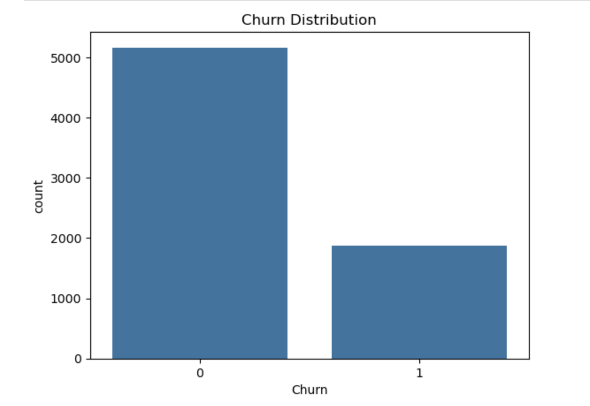

# 📊 Customer Churn Analysis

## Objective
Analyze customer data and predict churn using machine learning techniques to identify customers likely to leave.

## Tools & Technologies
- Python
- Pandas, NumPy
- Seaborn, Matplotlib
- Scikit-learn (Logistic Regression)

## Approach
- Performed data cleaning and preprocessing
- Converted categorical variables using encoding
- Conducted exploratory data analysis (EDA)
- Built a classification model to predict churn
- Evaluated model performance using accuracy and metrics

## Key Insights
- Customers with higher monthly charges are more likely to churn
- Short-term customers show higher churn rates
- Certain services significantly influence retention
- Customer behavior patterns can predict churn effectively

## 📊 Visualization

## Business Impact
- Helps businesses identify at-risk customers
- Enables proactive retention strategies
- Improves customer lifetime value

## Conclusion
This project highlights how data analysis and machine learning can be used to understand customer behavior and predict churn. The insights derived can help businesses take proactive measures to retain customers and improve overall profitability.
