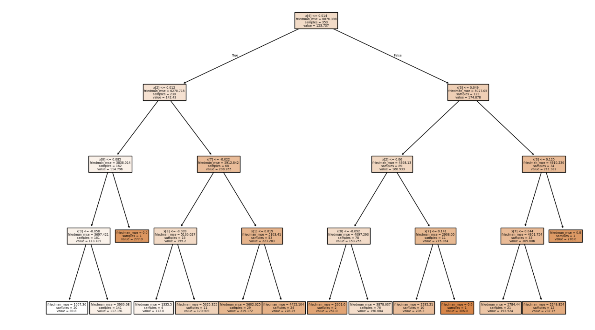

# 🩺 Diabetes Prediction using Machine Learning

## Objective
Predict diabetes progression using machine learning techniques.

## Model Used
- Decision Tree Regressor

## 🌳 Decision Tree Visualization

This diagram represents how the model splits data based on different features to make predictions.

## Model Interpretation
- The tree splits data based on key features to minimize prediction error
- Each node represents a decision rule applied to the dataset
- Leaf nodes show the final predicted values
- The model helps understand which features influence the prediction the most

## Steps
- Data preprocessing
- Model training
- Prediction

## Insights
- Identified patterns in patient data
- Evaluated model performance

## Outcome
Demonstrates application of machine learning in healthcare analytics.

## Key Insights
- Certain health metrics significantly influence diabetes progression
- Higher values in specific features indicate increased risk
- The model helps identify patients who may require early medical attention
- Machine learning can support healthcare decision-making and risk prediction

## Conclusion
This project demonstrates how machine learning can be applied to healthcare data to identify patterns and predict outcomes. The model provides valuable insights that can assist in early detection and improve decision-making in medical analysis.
